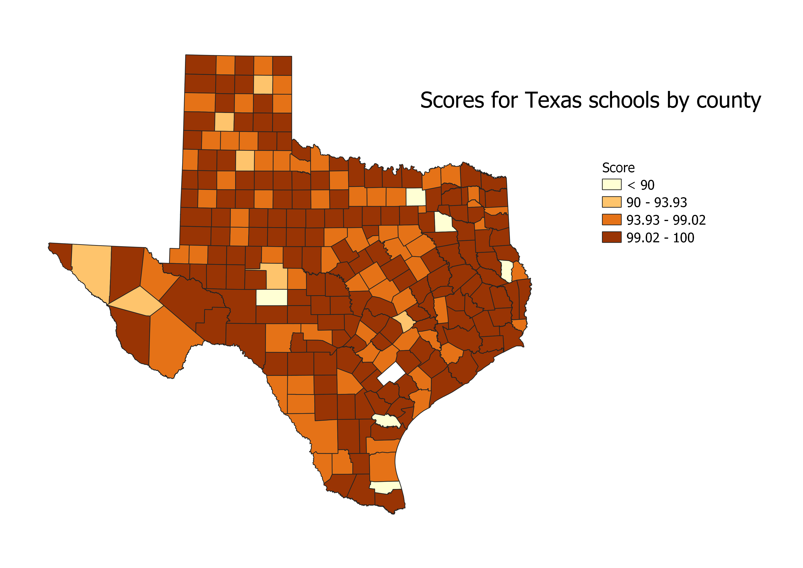

# FinalExam

<html lang="en">
<head>
    <meta charset="UTF-8">
    <meta name="viewport" content="width=device-width, initial-scale=1.0">
    <title>Final exam</title>
</head>
<body>
<h1>subheading</h1>
<h2>Madeline Scott</h2>
<h3>Description of map </h3>
<!-- Your map goes here -->

<!-- Link to your shapefile in Github and you CSV -->
<h2>Data used for this project</h2>
    <a href="./maps/cleaned2.csv"> CSV dataset </a>
    

    <a href="https://github.com/mscott2000/finalexampractice/blob/main/state.geojson"> Link to state vector </a>